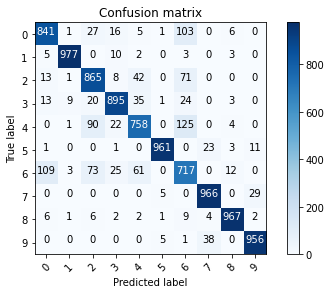
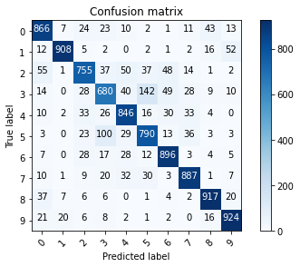

# CNN-pytorch
 Collection of CNN models and implementations

### Fashion-MNIST
CNN implementation for predicting items of clothing
#### Summary
 Using a relatively simple CNN model for image classicification. </br>
 
 MNIST data can be found [here](http://yann.lecun.com/exdb/mnist/) or in this case from [torchvision](https://pytorch.org/docs/stable/torchvision/index.html)
 #### Findings
 Classification results of CNN model trained on 15 epochs, final test accuracy of 88.84% <br>
 



### CIFAR-10
CNN implementation for predicting objects/animals
#### Summary
 Using a larger CNN model with batch normalisation for image classicification.
 
 Data augmentation of the image was necessary for training, see [here](https://pytorch.org/docs/stable/torchvision/transforms.html) for more information. <br>
 
_Example of data Augmentation used in final model_
 ```
transformer_train = torchvision.transforms.Compose([
    transforms.RandomCrop(32, padding=4),
    torchvision.transforms.RandomHorizontalFlip(p=0.5),
    torchvision.transforms.RandomAffine(0, translate=(0.1, 0.1)),
    transforms.ToTensor(),                                            
    ])
```
 
 CIFAR data can be found [here](https://www.cs.toronto.edu/~kriz/cifar.html) or in this case from [torchvision](https://pytorch.org/docs/stable/torchvision/index.html)
 #### Findings
 Classification results of CNN model trained on 30 epochs, final test accuracy of 84.96% <br>
 


</br>
